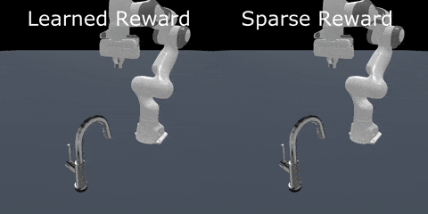
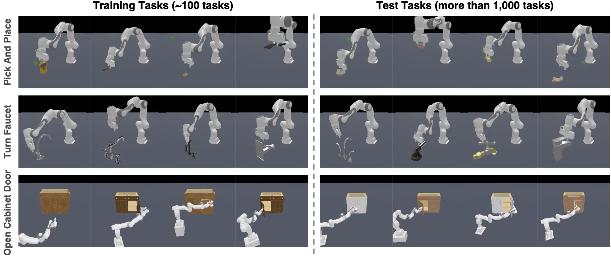

<h1>DrS</span></h1>

Official implementation of

[DrS: Learning Reusable Dense Rewards for Multi-Stage Tasks](https://sites.google.com/view/iclr24drs) by

[Tongzhou Mu](https://cseweb.ucsd.edu/~t3mu/), [Minghua Liu](https://cseweb.ucsd.edu/~mil070/), [Hao Su](https://cseweb.ucsd.edu/~haosu), (UC San Diego)</br>

</br>

[[Webpage]](https://sites.google.com/view/iclr24drs) [[Paper]](https://arxiv.org/abs/2404.16779) [[Video]](https://drive.google.com/file/d/1mEppov-oTdFAR4pQ6suFm3JJ2UFkw4wj/view?usp=sharing) [[Slides]](https://drive.google.com/file/d/1n3Voc1hLjqsFh-yUKhVspkaPKcytLp_s/view?usp=drive_link)

----

## Overview

**DrS** (**D**ense **r**eward learning from **S**tages) is a novel approach for learning reusable dense rewards for multi-stage tasks in a data-driven manner. By leveraging the stage structures of the task, DrS learns a high-quality dense reward from sparse rewards and demonstrations if given. The learned rewards can be reused in unseen tasks, thus reducing the human effort for reward engineering. 

<br/>


Extensive experiments on three physical robot manipulation task families with 1000+ task variants demonstrate that our learned rewards can be reused in unseen tasks, resulting in improved performance and sample efficiency of RL algorithms. The learned rewards even achieve comparable performance to human-engineered rewards on some tasks.


----

## Installation

1. Install all dependencies via `mamba` or `conda` by running the following command:

```bash
mamba env create -f environment.yml
mamba activate drs
```

Note: `mamba` is a drop-in replacement for `conda`. Feel free to use `conda` if you prefer it.


2. Download and link the necessary assets for ManiSkill

```bash
python -m mani_skill2.utils.download_asset partnet_mobility_faucet
python -m mani_skill2.utils.download_asset ycb
python -m mani_skill2.utils.download_asset egad
python -m mani_skill2.utils.download_asset partnet_mobility_cabinet
```

which downloads assets to `./data`. You may move these assets to any location. Then, add the following line to your `~/.bashrc` or `~/.zshrc`:

```bash
export MS2_ASSET_DIR=<path>/<to>/<data>
```

and restart your terminal. 

----


## Run Experiments

DrS has two phases:
- **Reward Learning Phase:** learn the dense reward function using training tasks.
- **Reward Reuse Phase:** reuse the learned dense reward to train new RL agents in test tasks.

We provide examples on how to reuse our pre-trained reward checkpoints, as well as how to learn your own dense reward functions, below.

### Reward Reuse

You can skip the reward learning phase and directly use the pre-trained reward checkpoints provided by us. See below examples on how to reuse the pre-trained reward checkpoints to train an RL agent from scratch.

The following commands should be run under the repo root dir.

```bash
python drs/drs_reuse_reward_maniskill2.py --env-id TurnFaucet_DrS_reuse-v0 --n-stages 2 --control-mode pd_ee_delta_pose --disc-ckpt reward_checkpoints/TurnFaucet.pt

python drs/drs_reuse_reward_maniskill2.py --env-id PickAndPlace_DrS_reuse-v0 --n-stages 3 --control-mode pd_ee_delta_pos --disc-ckpt reward_checkpoints/PickAndPlace.pt

python drs/drs_reuse_reward_maniskill2.py --env-id OpenCabinetDoor_DrS_reuse-v0 --n-stages 3 --control-mode base_pd_joint_vel_arm_pd_joint_vel --disc-ckpt reward_checkpoints/OpenCabinetDoor.pt
```

Note: 
- If you want to use [Weights and Biases](https://wandb.ai) (`wandb`) to track learning progress, please add `--track` to your commands.
- To run experiments on the task `PickAndPlace_DrS_reuse-v0`, you will probably need around 96GB memory since it loads a lot of objects.

### Reawrd Learning

Instead of using our pre-trained reward checkpoints, you can also train reward functions by yourself.

The following commands should be run under the repo root dir.

```bash
python drs/drs_learn_reward_maniskill2.py --env-id TurnFaucet_DrS_learn-v0 --n-stages 2 --control-mode pd_ee_delta_pose --demo-path demo_data/TurnFaucet_100.pkl

python drs/drs_learn_reward_maniskill2.py --env-id PickAndPlace_DrS_learn-v0 --n-stages 3 --control-mode pd_ee_delta_pos --demo-path demo_data/PickAndPlace_100.pkl

python drs/drs_learn_reward_maniskill2.py --env-id OpenCabinetDoor_DrS_learn-v0 --n-stages 3 --control-mode base_pd_joint_vel_arm_pd_joint_vel --demo-path demo_data/OpenCabinetDoor_200.pkl
```

----

## Citation

If you find our work useful, please consider citing our paper as follows:

```
@inproceedings{mu2024drs,
  title={DrS: Learning Reusable Dense Rewards for Multi-Stage Tasks},
  author={Mu, Tongzhou and Liu, Minghua and Su, Hao},
  booktitle={The Twelfth International Conference on Learning Representations},
  year={2024}
}
```

----

## Acknowledgments

This codebase is built upon [CleanRL](https://github.com/vwxyzjn/cleanrl) repository.

## License

This project is licensed under the MIT License - see the `LICENSE` file for details. Note that the repository relies on third-party code, which is subject to their respective licenses.